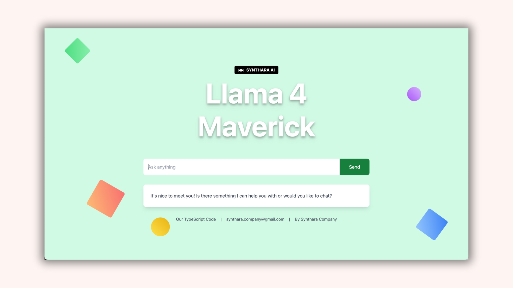

<div align="center">
  

  <h1>Llama 4 Maverick Chat Application</h1>

  <p>
    
    
    
    
    
    
  </p>
</div>

A modern React application for interacting with Meta's Llama 4 Maverick model via Together AI's API.

Inspired by the vision of natively integrated AI-powered applications, Synthara is proud to launch this modern chat interface for the Llama 4 Maverick model. This application combines a sleek, responsive design with powerful API integrations to deliver an excellent user experience.

## Overview

This application provides a clean, responsive interface for sending prompts to the Llama 4 Maverick model and displaying its responses. It features a modern, visually appealing design with animated 3D elements and markdown rendering for formatted responses. With an emphasis on reliability and ease of use, Synthara's solution is designed for modern developers and enterprises alike.

## Features

- **Modern UI:** Clean, responsive design with animated 3D elements
- **API Integration:** Seamless integration with Together AI's API
- **Markdown Rendering:** Supports formatted responses with markdown
- **Robust Handling:** Built-in error handling and loading states for a smooth user experience

## API Integration

The application leverages Together AI's API to access the Llama 4 Maverick model. Below are code snippets demonstrating how to integrate with the API.

### Using the Together AI Client Library

```javascript
import Together from 'together-ai';

// Initialize the client with your API key
const together = new Together({ apiKey: 'YOUR_API_KEY' });

// Make a request to the API
const response = await together.chat.completions.create({
  messages: [{ "role": "user", "content": "What are some fun things to do in New York?" }],
  model: "meta-llama/Llama-4-Maverick-17B-128E-Instruct-FP8",
});

// Access the response
console.log(response.choices[0].message.content);
```

### Using Fetch API Directly

```javascript
// Make a request to the API using fetch
const response = await fetch('https://api.together.ai/v1/chat/completions', {
  method: 'POST',
  headers: {
    'Content-Type': 'application/json',
    'Authorization': `Bearer ${apiKey}`
  },
  body: JSON.stringify({
    model: 'meta-llama/Llama-4-Maverick-17B-128E-Instruct-FP8',
    messages: [
      { role: 'user', content: prompt }
    ]
  })
});

// Parse the response
const data = await response.json();
console.log(data.choices[0].message.content);
```

## Test Script

A simple test script is provided to verify your API key and connection:

```javascript
// test-api-fetch.js
const apiKey = 'YOUR_API_KEY';

async function testAPI() {
  try {
    console.log('Testing API with key:', apiKey);

    const response = await fetch('https://api.together.ai/v1/chat/completions', {
      method: 'POST',
      headers: {
        'Content-Type': 'application/json',
        'Authorization': `Bearer ${apiKey}`
      },
      body: JSON.stringify({
        model: 'meta-llama/Llama-4-Maverick-17B-128E-Instruct-FP8',
        messages: [
          { role: 'user', content: 'What are some fun things to do in New York?' }
        ]
      })
    });

    if (!response.ok) {
      console.error('Error status:', response.status);
      console.error('Error text:', await response.text());
      return;
    }

    const data = await response.json();
    console.log('API Response:', JSON.stringify(data, null, 2));
    console.log('Message content:', data.choices[0].message.content);
  } catch (error) {
    console.error('API Error:', error);
  }
}

testAPI();
```

## Sample Output

When running the test script, you should see an output similar to:

```
Testing API with key: YOUR_API_KEY
API Response: {
  "id": "nowoNQi-zqrih-92bd95de8cd33c8e",
  "object": "chat.completion",
  "created": 1743903713,
  "model": "meta-llama/Llama-4-Maverick-17B-128E-Instruct-FP8",
  "choices": [
    {
      "index": 0,
      "message": {
        "role": "assistant",
        "content": "The city that never sleeps! New York is a vibrant and diverse city with endless options for entertainment, culture, and adventure. Here are some fun things to do in New York:..."
      },
      "finish_reason": "stop"
    }
  ],
  "usage": {
    "prompt_tokens": 21,
    "completion_tokens": 636,
    "total_tokens": 657
  }
}
```

## Setup

1. **Clone the repository:**
   `git clone https://github.com/bniladridas/llama4Maverick.git`
2. **Install dependencies:**
   Navigate to the project directory and run `npm install`
3. **Configure Environment:**
   Create a `.env` file in the root directory with your Together AI API key:
   ```env
   VITE_TOGETHER_API_KEY=your_api_key_here
   ```
4. **Start Development Server:**
   Run `npm run dev` to launch the application locally

## Important Notes

- **API Key Security:** Ensure your Together AI API key remains secure and is not committed to version control.
- **Model Initialization:** The Llama 4 Maverick model requires correct API initialization.
- **Client Library Version:** When using the Together AI client library, verify that you're using version 0.13.0 or higher.

## Troubleshooting

If you encounter issues with the Together AI client library, try using the direct fetch API approach as demonstrated above. This method provides clearer insights into error responses and facilitates debugging.

## License

This project is intended to be licensed under the MIT License.
